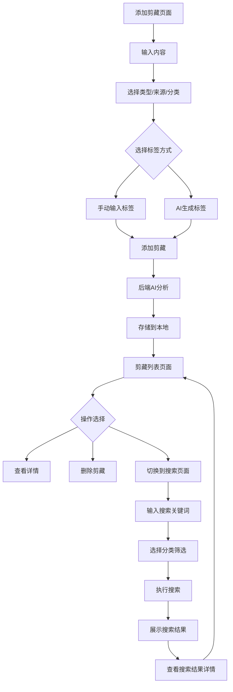

## 1. 产品概述
剪藏是一款个人信息管理工具，帮助用户捕捉、整理和管理各类信息，构建个人知识库。
- 解决用户信息碎片化、难以有效管理和检索的问题，目标用户为需要频繁收集和整理信息的个人用户。
- 产品价值在于提高信息管理效率，通过AI辅助实现智能整理和分析，形成结构化的个人知识体系。

## 2. 核心功能

### 2.1 用户角色
| 角色 | 注册方式 | 核心权限 |
|------|----------|----------|
| 个人用户 | 无需注册 | 可使用所有功能，数据存储在本地 |

### 2.2 功能模块
1. **添加剪藏页面**：内容输入、类型选择、来源选择、分类选择、标签管理、AI生成标签
2. **剪藏列表页面**：剪藏内容展示、AI分析结果、标签展示、搜索功能、删除功能
3. **信息检索页面**：关键词搜索、分类筛选、搜索结果展示

### 2.3 页面详情
| 页面名称 | 模块名称 | 功能描述 |
|---------|---------|----------|
| 添加剪藏页面 | 内容输入 | 支持文本输入和语音输入，用户可输入需要剪藏的内容 |
| 添加剪藏页面 | 类型选择 | 可选择剪藏类型：文本、图片、文件、链接 |
| 添加剪藏页面 | 来源选择 | 可选择信息来源：手动输入、浏览器、系统文件、剪贴板 |
| 添加剪藏页面 | 分类选择 | 可选择预定义分类：默认、技术、生活、工作、学习、健康、财经、娱乐 |
| 添加剪藏页面 | 标签管理 | 支持手动输入标签，按回车添加，最多10个标签 |
| 添加剪藏页面 | AI生成标签 | 可选择由AI自动生成标签，禁用手动输入 |
| 剪藏列表页面 | 剪藏内容展示 | 展示所有剪藏内容，包括原文、类型、来源、分类、标签 |
| 剪藏列表页面 | AI分析结果 | 展示AI对剪藏内容的分析结果，包括关键词提取和摘要，以Markdown格式渲染 |
| 剪藏列表页面 | 标签展示 | 展示剪藏的标签，超过3个标签时显示+N，点击可展开查看所有标签 |
| 剪藏列表页面 | 搜索功能 | 可通过切换按钮进入搜索页面，支持关键词搜索和分类筛选 |
| 剪藏列表页面 | 删除功能 | 支持删除剪藏内容，删除前显示确认弹窗 |
| 剪藏列表页面 | 发散性总结 | 可生成专家级分析，通过打字机效果展示结果 |
| 信息检索页面 | 关键词搜索 | 输入关键词进行搜索，支持模糊匹配 |
| 信息检索页面 | 分类筛选 | 可选择特定分类进行搜索 |
| 信息检索页面 | 搜索结果展示 | 展示搜索结果，包括剪藏内容和相关度 |

## 3. 核心流程
用户使用剪藏工具的主要流程如下：

1. 用户进入添加剪藏页面，输入内容并选择类型、来源、分类
2. 用户可选择手动输入标签或让AI自动生成标签
3. 点击"添加剪藏"按钮，系统将内容发送至后端
4. 后端使用AI分析内容，生成关键词和摘要
5. 系统将剪藏内容和AI分析结果存储到本地文件系统
6. 用户可在剪藏列表页面查看所有剪藏内容
7. 用户可点击"切换到信息检索"按钮进入搜索页面
8. 在搜索页面输入关键词和分类进行搜索
9. 系统返回搜索结果，用户可查看相关剪藏内容

## 4. 用户界面设计
### 4.1 设计风格
- 主色调：#3b82f6（蓝色）、#f59e0b（橙色）作为次要颜色
- 按钮风格：圆角矩形，带有轻微阴影和悬停效果
- 字体：Noto Sans SC（中文）、Rajdhani（英文）
- 布局风格：卡片式布局，清晰的层次结构
- 图标风格：简洁的线性图标，使用SVG格式

### 4.2 页面设计概览
| 页面名称 | 模块名称 | UI元素 |
|---------|---------|--------|
| 添加剪藏页面 | 内容输入 | 多行文本框，支持语音输入按钮，带有placeholder提示 |
| 添加剪藏页面 | 选择器 | 下拉选择框，带有自定义箭头图标 |
| 添加剪藏页面 | 标签管理 | 标签以彩色圆角矩形显示，带有删除按钮 |
| 添加剪藏页面 | AI生成标签 | 复选框样式，带有悬停效果 |
| 剪藏列表页面 | 剪藏卡片 | 白色背景，带有阴影，鼠标悬停时轻微上浮 |
| 剪藏列表页面 | 标签展示 | 标签以彩色圆角矩形显示，超过3个时显示+N按钮 |
| 剪藏列表页面 | 操作按钮 | 删除和展开按钮，图标式设计 |
| 剪藏列表页面 | 切换按钮 | 位于页面右上角，文字按钮，带有激活状态 |
| 信息检索页面 | 搜索框 | 输入框带有搜索图标，支持清除按钮 |
| 信息检索页面 | 搜索结果 | 与剪藏列表类似的卡片式布局 |

### 4.3 响应式设计
- 采用桌面优先设计，同时支持移动设备
- 在小屏幕设备上，布局将调整为垂直堆叠
- 按钮和输入框大小会根据屏幕尺寸自动调整
- 支持触摸操作，按钮和可点击元素尺寸适合手指点击

### 4.4 交互设计
- 添加剪藏时显示加载动画，提示用户AI正在分析
- 切换页面时使用平滑过渡效果
- 标签超过3个时显示+N，点击展开所有标签
- 发散性总结使用打字机效果展示，增强用户体验
- 删除操作前显示确认弹窗，防止误操作
- 悬停在按钮上时显示tooltip提示