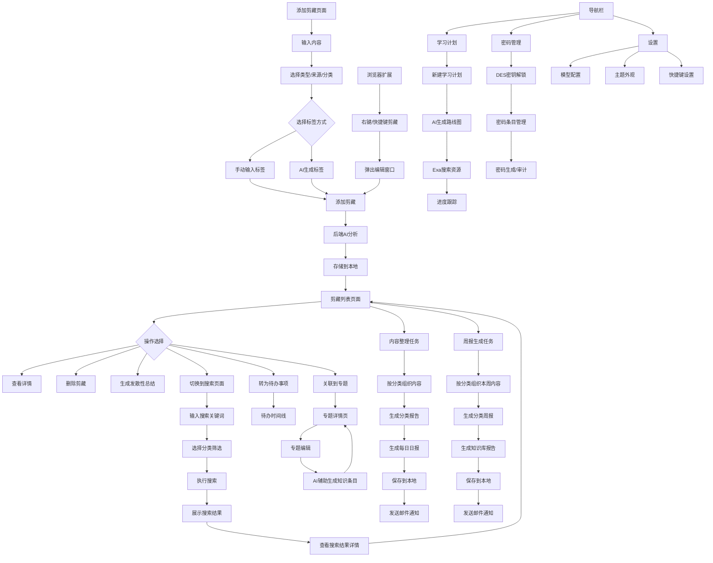

## 1. 产品概述

剪藏（CutShelter）是一款全功能个人信息管理工具，集信息剪藏、知识管理、密码管理、学习规划于一体，帮助用户捕捉、整理和管理各类信息，构建个人知识库。

- **问题解决**：解决用户信息碎片化、难以有效管理和检索的问题，目标用户为需要频繁收集和整理信息的个人用户。
- **产品价值**：提高信息管理效率，通过AI辅助实现智能整理和分析，形成结构化的个人知识体系。
- **核心优势**：本地存储保障数据安全，AI智能分析提升信息价值，简洁直观的Notion风格界面，支持多模型灵活切换，覆盖桌面端和浏览器扩展。

## 2. 核心功能

### 2.1 用户角色

| 角色   | 注册方式 | 核心权限            |
| ---- | ---- | --------------- |
| 个人用户 | 无需注册 | 可使用所有功能，数据存储在本地 |

### 2.2 功能模块

1. **添加剪藏模块**：内容输入、类型选择、来源选择、分类选择、标签管理、AI生成标签、图片上传
2. **剪藏管理模块**：剪藏内容展示、AI分析结果、标签展示、搜索功能、删除功能、发散性总结、剪藏转待办
3. **信息检索模块**：关键词搜索、分类筛选、搜索结果展示
4. **内容整理模块**：智能分类、收件箱整理、内容汇总、邮件通知
5. **周报生成模块**：周报生成、邮件通知
6. **专题管理模块**：专题创建、专题编辑、专题详情、剪藏关联
7. **待办管理模块**：待办时间线、待办创建/编辑/删除、剪藏转待办
8. **密码管理模块**：密码库加解密、密码条目管理、分类组织、密码生成器、安全审计、导入导出
9. **学习计划模块**：AI生成学习路线图、Mermaid可视化、阶段进度跟踪、Exa真实资源搜索
10. **浏览器扩展**：右键菜单剪藏、快捷键剪藏、弹出窗口编辑、智能内容提取
11. **Git同步模块**：Git配置、同步仓库
12. **系统配置模块**：存储路径配置、邮箱配置、模型配置（多模型+路由）、Prompt配置、主题外观设置、快捷键设置

### 2.3 功能详情

| 功能模块   | 功能点    | 详细描述                                    |
| ------ | ------ | --------------------------------------- |
| 添加剪藏模块 | 内容输入   | 支持文本输入和语音输入，用户可输入需要剪藏的内容，支持多行文本         |
| 添加剪藏模块 | 类型选择   | 可选择剪藏类型：AI文本整理、只存储内容、链接AI解析整理、文档AI解析整理     |
| 添加剪藏模块 | 来源选择   | 文本框输入，提示用户输入来源地址，如：www.sspai.com           |
| 添加剪藏模块 | 分类选择   | 可选择预定义分类：工作项目、学习成长、生活健康、兴趣探索、财务规划、人脉社交，默认AI匹配分类 |
| 添加剪藏模块 | 标签管理   | 支持手动输入标签，按回车添加，最多10个标签                  |
| 添加剪藏模块 | AI生成标签 | 可选择由AI自动生成标签，禁用手动输入                     |
| 添加剪藏模块 | 图片上传   | 支持粘贴图片和批量上传图片，自动存储并在内容中添加图片引用           |
| 剪藏管理模块 | 剪藏内容展示 | 展示所有剪藏内容，包括原文、类型、来源、分类、标签               |
| 剪藏管理模块 | AI分析结果 | 展示AI对剪藏内容的分析结果，包括关键词提取和摘要，以Markdown格式渲染 |
| 剪藏管理模块 | 标签展示   | 展示剪藏的标签，超过3个标签时显示+N，点击可展开查看所有标签         |
| 剪藏管理模块 | 搜索功能   | 可通过切换按钮进入搜索页面，支持关键词搜索和分类筛选              |
| 剪藏管理模块 | 删除功能   | 支持删除剪藏内容，删除前显示确认弹窗                      |
| 剪藏管理模块 | 发散性总结  | 可生成专家级分析，通过打字机效果展示结果                    |
| 剪藏管理模块 | 剪藏转待办  | 可将剪藏内容一键转为待办事项，自动关联原始内容                |
| 信息检索模块 | 关键词搜索  | 输入关键词进行搜索，支持模糊匹配和同义词搜索                  |
| 信息检索模块 | 分类筛选   | 可选择特定分类进行搜索，支持一级和二级分类                   |
| 信息检索模块 | 搜索结果展示 | 展示搜索结果，包括剪藏内容和相关度                       |
| 内容整理模块 | 智能分类   | 自动按分类组织剪藏内容，生成分类报告                      |
| 内容整理模块 | 收件箱整理  | 支持收件箱模式整理，将未分类内容智能归类                    |
| 内容整理模块 | 内容汇总   | 生成每日剪藏日报，包含所有分类的内容摘要                    |
| 内容整理模块 | 邮件通知   | 可配置邮件通知，将每日剪藏日报发送到指定邮箱                  |
| 周报生成模块 | 周报生成   | 生成每周剪藏周报，按分类组织内容，生成知识库格式报告             |
| 周报生成模块 | 邮件通知   | 可配置邮件通知，将周报发送到指定邮箱                      |
| 专题管理模块 | 专题创建   | 创建专题，包含标题、描述、关联分类等，可手动或AI辅助生成           |
| 专题管理模块 | 专题编辑   | 编辑专题内容，支持Markdown编辑器，可关联剪藏条目             |
| 专题管理模块 | 专题详情   | 查看专题详情，展示关联剪藏内容，支持分区展示                 |
| 专题管理模块 | 剪藏关联   | 在剪藏详情中可将剪藏条目关联到已有专题                     |
| 待办管理模块 | 待办创建   | 创建待办事项，设置截止日期、状态等                       |
| 待办管理模块 | 待办编辑   | 编辑待办内容、截止日期、状态                          |
| 待办管理模块 | 待办删除   | 删除待办事项，删除前确认                            |
| 待办管理模块 | 时间线展示  | 按截止日期升序展示待办列表，支持状态筛选                   |
| 密码管理模块 | 密码库加解密 | 使用DES加密算法保护密码库，用户持有密钥，零知识架构              |
| 密码管理模块 | 密码条目管理 | 创建/编辑/删除密码条目，包含网站、用户名、密码、备注等字段，支持复制密码  |
| 密码管理模块 | 分类组织   | 支持按分类侧边栏组织密码（登录/卡片/笔记/身份），支持文件夹管理      |
| 密码管理模块 | 密码生成器  | 可配置长度、字符集（大小写字母/数字/符号），一键生成随机强密码          |
| 密码管理模块 | 安全审计   | 检测弱密码、重复密码，提供安全仪表盘和强度评分                |
| 密码管理模块 | 导入导出   | 支持CSV格式导入密码，支持加密导出密码库备份                 |
| 学习计划模块 | 创建计划   | 输入学习主题、当前水平、学习目标、每周投入时间，AI生成分阶段学习路线图    |
| 学习计划模块 | 路线图可视化 | 使用Mermaid.js渲染学习路径图，直观展示各阶段关系              |
| 学习计划模块 | 阶段管理   | 每个阶段包含学习目标、推荐资源、知识作业、实战任务，支持进度跟踪和完成标记   |
| 学习计划模块 | 资源搜索   | 集成Exa语义搜索引擎，为每个阶段搜索真实、高质量的学习资源（教程/文档/视频） |
| 学习计划模块 | 资源降级   | Exa不可用时自动降级为AI推荐资源，确保功能正常使用              |
| 浏览器扩展  | 右键菜单剪藏 | 右键点击页面任意位置，选择剪藏整个页面、选中内容或图片             |
| 浏览器扩展  | 快捷键剪藏  | 支持Ctrl+Shift+S剪藏页面、Ctrl+Shift+D剪藏选中内容          |
| 浏览器扩展  | 弹出窗口编辑 | 剪藏前可在弹出窗口中编辑内容，选择剪藏类型和分类               |
| 浏览器扩展  | 智能内容提取 | 自动识别网页正文内容，过滤广告和导航等无关信息                |
| 浏览器扩展  | 配置管理   | 可配置后端API地址，支持测试连接，配置持久化                 |
| Git同步模块 | Git配置   | 可配置远程仓库地址、用户名、密码、分支信息                 |
| Git同步模块 | 同步仓库   | 执行Git同步操作，包括pull、commit、push到远程仓库        |
| 系统配置模块 | 存储路径配置 | 可配置剪藏存储、整理存储和周报存储的路径                   |
| 系统配置模块 | 邮箱配置   | 可配置邮件服务器和收件人信息，用于发送日报和周报               |
| 系统配置模块 | 模型配置   | 可配置多个AI模型（DashScope、DeepSeek），支持自定义API地址和模型名称 |
| 系统配置模块 | Prompt配置 | 可自定义AI提示词，支持不同场景（分析、总结、标签生成等）的Prompt模板 |
| 系统配置模块 | LLM路由   | 可按场景配置模型路由策略，不同任务使用不同模型，支持模型自动分配     |
| 系统配置模块 | 主题外观   | 支持Notion风格、常规浅色、深色主题，支持跟随系统自动切换，即时生效    |
| 系统配置模块 | 快捷键设置  | 可配置全局快捷键（唤起/隐藏应用窗口），支持自定义快捷键组合         |

## 3. 核心流程

用户使用剪藏工具的主要流程如下：

1. **添加剪藏流程**：
   - 用户进入添加剪藏页面，输入内容并选择类型、来源、分类
   - 用户可选择手动输入标签或让AI自动生成标签
   - 点击"添加剪藏"按钮，系统将内容发送至后端
   - 后端使用AI分析内容，生成关键词和摘要
   - 系统将剪藏内容和AI分析结果存储到本地文件系统

2. **剪藏管理流程**：
   - 用户在剪藏列表页面查看所有剪藏内容
   - 用户可点击剪藏卡片查看详细信息和AI分析结果
   - 用户可点击删除按钮删除剪藏内容
   - 用户可点击"发散性总结"按钮生成专家级分析
   - 用户可将剪藏条目转为待办事项或关联到专题

3. **信息检索流程**：
   - 用户点击"切换到信息检索"按钮进入搜索页面
   - 在搜索页面输入关键词和选择分类进行搜索
   - 系统返回搜索结果，用户可查看相关剪藏内容
   - 用户可点击搜索结果查看详细信息

4. **内容整理流程**：
   - 系统每日自动执行内容整理任务
   - 系统按分类组织当日剪藏内容
   - 系统生成分类报告和每日剪藏日报
   - 系统将整理结果保存到本地文件系统
   - 系统可配置发送邮件通知，将日报发送到指定邮箱

5. **周报生成流程**：
   - 系统每周自动执行周报生成任务
   - 系统按分类组织本周剪藏内容
   - 系统生成分类周报和知识库格式报告
   - 系统将周报结果保存到本地文件系统
   - 系统可配置发送邮件通知，将周报发送到指定邮箱

6. **专题管理流程**：
   - 用户创建专题，填写标题、描述和关联分类
   - 用户可在专题编辑器中撰写内容（Markdown格式）
   - 用户可将剪藏条目关联到专题
   - 专题详情页展示关联剪藏内容，支持分区展示
   - 系统可基于专题内容通过AI辅助生成知识条目

7. **密码管理流程**：
   - 用户首次使用需生成DES加密密钥（Base64编码，用户自行保存）
   - 输入密钥解锁密码库，后端解密后返回明文数据
   - 用户可浏览、搜索、创建、编辑、删除密码条目
   - 支持按分类（登录/卡片/笔记/身份）侧边栏筛选
   - 密码生成器可按需生成随机强密码
   - 安全审计自动检测弱密码和重复密码
   - 支持CSV导入密码库和加密导出备份

8. **学习计划流程**：
   - 用户输入学习主题、当前水平、学习目标和时间投入
   - AI生成分阶段学习路线图结构（阶段划分+目标+作业+任务）
   - Exa搜索引擎为每个阶段搜索真实学习资源链接
   - 生成Mermaid可视化路径图展示学习路线
   - 用户可逐阶段标记进度和完成状态
   - 学习资源可点击跳转至外部教程/文档/视频

9. **浏览器扩展流程**：
   - 用户在浏览器中安装扩展，配置后端API地址
   - 浏览网页时通过右键菜单或快捷键发起剪藏
   - 弹出窗口展示提取的页面内容，用户可编辑和选择分类
   - 确认后内容发送至后端进行AI分析

10. **主题切换流程**：
    - 用户在设置页面选择主题外观（Notion风格/常规浅色/深色/跟随系统）
    - 主题变更通过localStorage存储，所有页面即时响应
    - 父窗口通过postMessage向所有iframe子页面广播主题变更
    - 支持跨标签页同步主题设置



## 4. 技术架构

### 4.1 系统架构

- **前端**：HTML5 + CSS3 + JavaScript，使用Marked.js渲染Markdown，Mermaid.js渲染学习路径图，支持Notion风格/常规/深色三种主题切换
- **后端**：Spring Boot 3.2.0，Java 17，多LLM提供者抽象架构（LlmProvider接口 + RoutingLlmProvider路由）
- **AI服务**：多模型支持，包含DashScope（Qwen系列）和DeepSeek，通过LLM路由可灵活切换
- **搜索引擎**：Exa语义搜索API，为学习计划模块提供真实学习资源搜索
- **加密**：DES算法加密密码库，密钥由用户持有，零知识架构
- **存储**：本地文件系统，JSON格式存储剪藏内容和配置，加密文件存储密码库，支持向量嵌入（Embedding）检索
- **邮件服务**：Spring Boot Mail，支持SMTP配置
- **周报服务**：WeeklyReportService，生成每周剪藏周报
- **内容整理服务**：ContentOrganizeService，生成每日剪藏日报，支持收件箱整理
- **Git同步服务**：GitService，支持配置远程仓库和自动同步
- **桌面应用**：Electron 28+，electron-builder打包，支持Windows/macOS/Linux，自定义标题栏，启动加载动画
- **浏览器扩展**：Chrome Manifest V3，支持右键菜单、快捷键、弹出窗口

### 4.2 核心技术栈

| 技术              | 版本     | 用途               |
| --------------- | ------ | ---------------- |
| Spring Boot     | 3.2.0  | 后端框架             |
| Java            | 17     | 后端开发语言           |
| HTML5           | 5      | 前端结构             |
| CSS3            | 3      | 前端样式             |
| JavaScript      | ES6+   | 前端逻辑             |
| Marked.js       | 12+    | Markdown渲染       |
| Mermaid.js      | 10+    | 学习路径图可视化         |
| DashScope SDK   | 2.16.0 | AI服务集成（通义千问系列模型） |
| DeepSeek API    | -      | AI服务集成（DeepSeek模型） |
| Exa API         | -      | 语义搜索引擎（学习资源搜索）   |
| Spring AI       | 0.8.1  | AI框架集成           |
| Jsoup           | 1.17.2 | HTML解析           |
| Apache PDFBox   | 3.0.5  | PDF解析            |
| Apache POI      | 5.2.5  | Office文档解析       |
| JGit / Git CLI  | -      | Git操作            |
| Chrome Extension | Manifest V3 | 浏览器扩展        |
| Electron        | 28+    | 桌面应用框架           |
| Electron Builder | 24.9+ | 桌面应用打包           |

### 4.3 LLM多模型架构

系统采用多LLM提供者架构，支持灵活扩展和智能路由：

- **LLM提供者抽象层**：`LlmProvider` 接口定义统一AI调用规范（`chat`、`getProviderName`、`isAvailable`）
- **DashScope提供者**：`DashScopeLlmProvider`，集成阿里云通义千问系列模型
- **DeepSeek提供者**：`DeepSeekLlmProvider`，集成DeepSeek大模型，通过Spring AI的OpenAiChatModel调用
- **路由提供者**：`RoutingLlmProvider`，按场景（分析、总结、标签生成、学习计划、嵌入等）智能分配模型
- **模型配置**：支持自定义API地址、模型名称、API Key，配置存储在`model-config.json`，优先级高于`application.yml`
- **Prompt配置**：支持自定义各场景的Prompt模板
- **嵌入配置**：`EmbeddingConfig`，支持向量嵌入检索增强
- **热切换**：模型切换即时生效，无需重启服务，支持API Key测试连接

### 4.4 Exa搜索集成

学习计划模块集成Exa语义搜索引擎，为每个学习阶段搜索真实学习资源：

- **搜索策略**：每个阶段执行中英文双向搜索，覆盖教程、文档、视频、论文
- **内容提取**：返回资源标题、URL、摘要、来源标识
- **降级机制**：Exa不可用时自动降级为AI生成资源，标记`source: "ai"`

### 4.5 密码加密架构

密码管理模块采用DES加密算法，零知识架构：

- **加密算法**：DES/ECB/PKCS5Padding
- **密钥管理**：用户生成8字节随机密钥（SecureRandom），Base64编码后由用户自行保存
- **加解密流程**：用户输入Key → Base64解码 → DES解密 → 内存中返回明文 → 操作后重新加密存储
- **存储格式**：加密后写入`vault.enc`文件，非敏感元数据存储于`vault-meta.json`

### 4.6 目录结构

```
├── backend/                          # 后端代码
│   ├── src/main/java/com/example/clip/
│   │   ├── config/                   # 配置类（存储、Git、图片、Prompt等）
│   │   ├── controller/               # 控制器（Clip、Todo、Topic、Git、ModelConfig、WeeklyReport、LearningPlan、PasswordVault）
│   │   ├── core/                     # 核心服务（AI、LLM提供者、路由、嵌入、定时任务、DES加密）
│   │   ├── dto/                      # 数据传输对象
│   │   ├── model/                    # 数据模型（ClipContent、TodoContent、Topic、KnowledgeEntry、LearningPlan、PasswordEntry）
│   │   ├── service/                  # 业务服务（Clip、Todo、Topic、搜索、邮件、Git、文档解析、链接解析、Exa搜索、学习计划、密码管理等）
│   │   └── ClipDemoApplication.java  # 应用入口
│   ├── src/main/resources/           # 资源文件
│   └── pom.xml                       # Maven配置
├── frontend/                         # 前端代码
│   ├── index.html                    # 主页面（SPA路由 + 导航切换）
│   ├── clip.html                     # 剪藏页面
│   ├── todo.html                     # 待办时间线页面
│   ├── topic.html                    # 专题列表页面
│   ├── topic-detail.html             # 专题详情页面
│   ├── topic-editor.html             # 专题编辑器页面
│   ├── settings.html                 # 系统设置页面（模型配置 + 主题外观 + 快捷键）
│   ├── learning-plan.html            # 学习计划页面（列表 + 详情 + 新建弹窗）
│   ├── vault.html                    # 密码管理页面（锁屏 + 列表 + 详情 + 生成器）
│   ├── styles/                       # 样式文件
│   │   ├── theme-notion.css          # Notion风格主题
│   │   ├── theme-regular.css         # 常规主题
│   │   └── clip-theme-notion.css     # 剪藏Notion主题
│   ├── libs/                         # 第三方库
│   │   ├── marked.min.js             # Markdown渲染
│   │   └── html2canvas.min.js        # 截图导出
│   ├── start-mac.sh                  # macOS前端启动脚本
│   └── start-win.bat                 # Windows前端启动脚本
├── browser-extension/                # 浏览器扩展
│   ├── manifest.json                 # Chrome扩展配置
│   ├── background.js                 # 后台脚本（右键菜单、快捷键）
│   ├── popup.html / popup.js         # 弹出窗口
│   ├── options.html / options.js     # 设置页面
│   ├── content.js                    # 内容脚本（智能提取）
│   └── icons/                        # 扩展图标
├── electron/                         # Electron桌面应用
│   ├── main.js                       # 主进程（窗口管理、后端进程管理、IPC通信）
│   ├── preload.js                    # 预加载脚本（IPC通信桥接）
│   ├── config.html                   # 配置界面（首次启动设置）
│   └── icon.png                      # 应用图标
├── package.json                      # Electron依赖和打包配置
├── build.bat / build.sh              # 一键构建脚本
├── start.bat / start.sh              # 一键启动脚本
├── stop.bat / stop.sh                # 一键停止脚本
├── prepare-jre.bat                   # JRE自动下载脚本
├── .npmrc                            # npm镜像配置
├── PRD.md                            # 产品需求文档
├── README.md                         # 项目说明
└── 打包说明.md                         # 打包详细说明
```

## 5. 用户界面设计

### 5.1 设计风格

- **主色调**：#3f8cff（蓝色）、#2383e2（Notion风格蓝色）、#f59e0b（橙色）作为次要颜色
- **按钮风格**：圆角矩形，带有轻微阴影和悬停效果
- **字体**：IBM Plex Sans（英文）、Noto Sans SC（中文）
- **布局风格**：卡片式布局，清晰的层次结构，Obsidian风格自定义标题栏
- **图标风格**：简洁的线性图标，使用SVG格式
- **间距规范**：8px基础间距，采用4倍原则
- **主题切换**：支持Notion风格（暖灰调）、常规浅色（蓝色调）、深色主题，支持跟随系统自动切换

### 5.2 页面设计概览

| 页面名称   | 模块名称   | UI元素                                 |
| ------ | ------ | ------------------------------------ |
| 添加剪藏页面 | 内容输入   | 多行文本框，支持语音输入按钮，带有placeholder提示，自适应高度 |
| 添加剪藏页面 | 选择器    | 下拉选择框，带有自定义箭头图标，支持搜索和多选              |
| 添加剪藏页面 | 标签管理   | 标签以彩色圆角矩形显示，带有删除按钮，支持拖拽排序            |
| 添加剪藏页面 | AI生成标签 | 复选框样式，带有悬停效果，选中时显示AI分析中动画            |
| 剪藏列表页面 | 剪藏卡片   | 白色背景，带有阴影，鼠标悬停时轻微上浮，显示操作按钮           |
| 剪藏列表页面 | 标签展示   | 标签以彩色圆角矩形显示，超过3个时显示+N按钮，点击展开所有标签     |
| 剪藏列表页面 | 操作按钮   | 删除和展开按钮，图标式设计，悬停时显示tooltip           |
| 剪藏列表页面 | 切换按钮   | 位于页面右上角，文字按钮，带有激活状态，点击切换页面           |
| 信息检索页面 | 搜索框    | 输入框带有搜索图标，支持清除按钮，回车执行搜索              |
| 信息检索页面 | 搜索结果   | 与剪藏列表类似的卡片式布局，显示搜索相关度                |
| 信息检索页面 | 分类筛选   | 侧边栏形式，支持多级分类展开/折叠                    |
| 专题列表页面 | 专题卡片   | 卡片式展示，包含标题、描述、关联剪藏数量                 |
| 专题详情页面 | 分区展示   | 支持分区展示内容，关联剪藏列表，可跳转至剪藏详情            |
| 专题编辑页面 | Markdown编辑器 | 支持Markdown编辑，工具栏，实时预览，AI辅助生成         |
| 待办时间线   | 待办列表   | 按日期分组展示，支持复选框标记完成，时间线视觉样式            |
| 密码管理页面 | 锁屏界面   | 居中输入框，输入DES密钥解锁密码库，密码模式输入             |
| 密码管理页面 | 密码列表   | 分类侧边栏 + 卡片列表，支持搜索和复制密码               |
| 密码管理页面 | 密码详情   | 查看/编辑密码条目，展示网站/用户名/密码/备注/分类等字段       |
| 密码管理页面 | 密码生成器  | 滑块配置长度，多选字符集，一键生成并复制随机密码             |
| 密码管理页面 | 安全审计   | 仪表盘展示弱密码、重复密码数量，按严重程度分级提示            |
| 密码管理页面 | 导入导出   | 支持CSV文件导入密码，支持加密导出密码库备份文件             |
| 学习计划页面 | 计划列表   | 卡片式展示所有学习计划，显示标题、阶段数、进度百分比、创建时间      |
| 学习计划页面 | 新建弹窗   | 表单包含主题、水平、目标、时间投入，提交后显示分步加载动画        |
| 学习计划页面 | 详情页面   | Mermaid路径图 + 阶段折叠卡片，每个阶段含资源/作业/任务       |
| 学习计划页面 | 资源卡片   | 显示资源标题、摘要、来源标签（Exa搜索/AI推荐），可点击跳转外链    |
| 系统设置页面 | 配置表单   | 分组配置：外观主题、快捷键、模型配置（DashScope/DeepSeek）、测试连接 |

### 5.3 响应式设计

- **设计原则**：桌面优先设计，同时支持移动设备
- **断点设置**：
  - 桌面：1200px+
  - 平板：768px - 1199px
  - 移动：360px - 767px
- **布局调整**：
  - 在小屏幕设备上，布局将调整为垂直堆叠
  - 侧边栏在移动设备上变为底部导航
  - 按钮和输入框大小会根据屏幕尺寸自动调整
- **触摸优化**：
  - 支持触摸操作，按钮和可点击元素尺寸适合手指点击
  - 增加触摸反馈，如点击波纹效果

### 5.4 交互设计

- **加载状态**：添加剪藏时显示加载动画，AI生成学习计划时显示分步进度提示，Electron启动时显示加载遮罩
- **过渡效果**：切换页面时使用平滑过渡效果，增强用户体验
- **标签交互**：标签超过3个时显示+N，点击展开所有标签，支持点击标签筛选内容
- **发散性总结**：使用打字机效果展示，增强用户体验和期待感
- **删除操作**：删除前显示确认弹窗，防止误操作
- **悬停效果**：悬停在按钮上时显示tooltip提示，悬停在卡片上时显示操作按钮
- **键盘导航**：支持键盘快捷键，如Ctrl+K快速搜索，Enter添加标签等
- **主题切换**：支持一键切换Notion风格、常规浅色、深色主题和跟随系统，通过localStorage持久化，postMessage向子页面广播
- **密码复制**：点击复制按钮一键复制密码，2秒后按钮恢复，密码不持久化在剪贴板
- **阶段折叠**：学习计划阶段卡片支持折叠展开，完成状态可一键标记

## 6. 数据存储

### 6.1 存储结构

- **剪藏内容**：以JSON格式存储在本地文件系统，按分类和日期组织
- **存储路径**：`./clip-storage/{category}/{date}.json`
- **整理结果**：存储在`./clip-organized/{category}/{date}.md`
- **周报结果**：存储在`./clip-weekly-report/{category}/{year}_W{week}/{category}_周报_{year}_W{week}.md`
- **待办数据**：存储在`./clip-storage/todos.json`
- **专题数据**：存储在`./clip-storage/topics.json`
- **知识条目**：存储在`./clip-storage/knowledge/{topicId}/`
- **学习计划**：存储在`./clip-storage/learning-plans.json`
- **密码库**：加密存储在`./clip-storage/vault/vault.enc`，元数据存储在`vault-meta.json`
- **配置数据**：存储在用户目录`~/.clip-demo/`，包括Git配置、Prompt配置、模型配置（`model-config.json`）等

### 6.2 数据模型

```json
{
  "id": 1,
  "content": "剪藏内容",
  "type": "text",
  "source": "manual",
  "category": "work",
  "tags": ["标签1", "标签2"],
  "createdAt": "2023-04-16T10:00:00",
  "summary": "内容摘要",
  "analysis": "AI分析结果",
  "topicId": 1,
  "embedding": [0.1, 0.2, ...]
}
```

## 7. 性能要求

- **响应时间**：添加剪藏操作响应时间不超过3秒
- **搜索速度**：搜索操作响应时间不超过1秒
- **AI分析**：AI分析时间不超过5秒
- **存储效率**：剪藏内容压缩存储，减少磁盘占用
- **并发处理**：支持多线程处理，提高批量操作效率
- **模型切换**：模型切换即时生效，无需重启服务

## 8. 部署与维护

### 8.1 部署方式

- **桌面应用**：使用Electron打包为桌面应用（Windows .exe / macOS .dmg / Linux .AppImage），支持内嵌JRE，启动时显示加载动画，后端异步启动
- **本地服务**：Spring Boot应用作为本地服务运行，支持手动启动（start.bat/sh）
- **源码运行**：支持直接运行源码，前端通过Python HTTP Server或npx serve托管
- **浏览器扩展**：Chrome浏览器加载已解压的扩展程序，配置后端API地址即可使用
- **依赖管理**：使用Maven和npm管理依赖

### 8.2 打包说明

- **一键构建**：`build.bat`（Windows）或 `build.sh`（macOS/Linux）自动完成JAR编译、JRE准备、Electron打包
- **JRE准备**：`prepare-jre.bat` 自动下载Eclipse Temurin JRE 21，打包后应用无需用户安装Java
- **npm镜像**：通过`.npmrc`配置国内镜像加速Electron下载
- **构建产物**：输出到`dist-electron/`目录

### 8.3 维护计划

- **日志管理**：定期清理日志文件，保持系统整洁
- **数据备份**：建议用户通过Git同步功能定期备份剪藏数据
- **版本更新**：提供自动更新机制，确保功能及时更新
- **错误处理**：完善的错误处理和日志记录，便于问题排查

## 9. 安全考虑

- **数据安全**：所有数据存储在本地，不涉及云端存储
- **隐私保护**：用户数据完全掌控在用户手中
- **密码加密**：密码库使用DES算法加密存储，密钥由用户持有，零知识架构
- **输入验证**：对用户输入进行严格验证，防止恶意输入
- **文件安全**：对上传的文件进行安全检查，防止恶意文件
- **AI安全**：使用官方API，确保AI服务的安全性和可靠性
- **API Key保护**：API Key存储在本地配置文件，不上传至任何远程服务器
- **Git安全**：支持Token认证，密码本地加密存储

## 10. 导航架构

### 10.1 桌面端导航

桌面应用采用Obsidian风格自定义标题栏，SPA单页路由切换，导航栏包含：

| 导航项 | 图标 | 路由 | 说明 |
| ------ | ---- | ---- | ---- |
| 首页 | 网格 | `/` | 双栏布局：左侧待办时间线 + 右侧剪藏管理 |
| 话题 | 时钟 | `/topic` | 专题列表管理 |
| 密码 | 锁 | `/vault` | 密码管理器（需DES密钥解锁） |
| 学习 | 学位帽 | `/learning-plan` | 学习计划管理 |
| 设置 | 齿轮 | `/settings` | 主题外观 + 模型配置 + 快捷键 |

### 10.2 浏览器扩展

Chrome浏览器扩展提供以下入口方式：
- **右键菜单**：在任意网页右键 → "智能剪藏" → 选择剪藏方式
- **快捷键**：`Ctrl+Shift+S` 剪藏页面、`Ctrl+Shift+D` 剪藏选中内容
- **工具栏图标**：点击扩展图标打开弹出窗口编辑剪藏内容

### 10.3 主题系统

主题系统采用CSS变量 + `data-theme` 属性架构：
- **存储键**：`localStorage` 中 `app_theme_v1`（当前主题）和 `app_appearance_v1`（外观设置）
- **广播机制**：父窗口通过 `postMessage` 向所有iframe子页面广播 `themeChange` 事件
- **跨标签页同步**：通过 `storage` 事件监听实现多窗口主题同步
- **系统主题跟随**：监听 `prefers-color-scheme: dark` 媒体查询变化