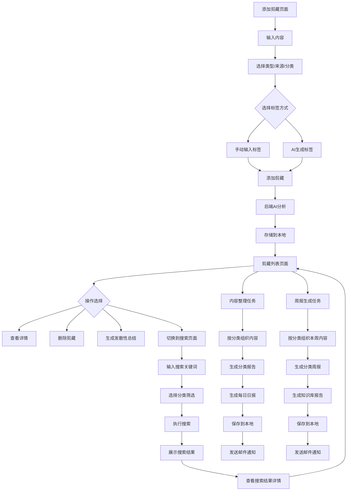

## 1. 产品概述

剪藏是一款个人信息管理工具，帮助用户捕捉、整理和管理各类信息，构建个人知识库。

- **问题解决**：解决用户信息碎片化、难以有效管理和检索的问题，目标用户为需要频繁收集和整理信息的个人用户。
- **产品价值**：提高信息管理效率，通过AI辅助实现智能整理和分析，形成结构化的个人知识体系。
- **核心优势**：本地存储保障数据安全，AI智能分析提升信息价值，简洁直观的用户界面。

## 2. 核心功能

### 2.1 用户角色

| 角色   | 注册方式 | 核心权限            |
| ---- | ---- | --------------- |
| 个人用户 | 无需注册 | 可使用所有功能，数据存储在本地 |

### 2.2 功能模块

1. **添加剪藏模块**：内容输入、类型选择、来源选择、分类选择、标签管理、AI生成标签
2. **剪藏管理模块**：剪藏内容展示、AI分析结果、标签展示、搜索功能、删除功能、发散性总结
3. **信息检索模块**：关键词搜索、分类筛选、搜索结果展示
4. **内容整理模块**：智能分类、内容汇总、邮件通知

### 2.3 功能详情

| 功能模块   | 功能点    | 详细描述                                    |
| ------ | ------ | --------------------------------------- |
| 添加剪藏模块 | 内容输入   | 支持文本输入和语音输入，用户可输入需要剪藏的内容，支持多行文本         |
| 添加剪藏模块 | 类型选择   | 可选择剪藏类型：AI文本整理、只存储内容、链接AI解析整理、文档AI解析整理     |
| 添加剪藏模块 | 来源选择   | 文本框输入，提示用户输入来源地址，如：www.sspai.com           |
| 添加剪藏模块 | 分类选择   | 可选择预定义分类：工作项目、学习成长、生活健康、兴趣探索、财务规划、人脉社交，默认AI匹配分类 |
| 添加剪藏模块 | 标签管理   | 支持手动输入标签，按回车添加，最多10个标签                  |
| 添加剪藏模块 | AI生成标签 | 可选择由AI自动生成标签，禁用手动输入                     |
| 添加剪藏模块 | 图片上传   | 支持粘贴图片和批量上传图片，自动存储并在内容中添加图片引用           |
| 剪藏管理模块 | 剪藏内容展示 | 展示所有剪藏内容，包括原文、类型、来源、分类、标签               |
| 剪藏管理模块 | AI分析结果 | 展示AI对剪藏内容的分析结果，包括关键词提取和摘要，以Markdown格式渲染 |
| 剪藏管理模块 | 标签展示   | 展示剪藏的标签，超过3个标签时显示+N，点击可展开查看所有标签         |
| 剪藏管理模块 | 搜索功能   | 可通过切换按钮进入搜索页面，支持关键词搜索和分类筛选              |
| 剪藏管理模块 | 删除功能   | 支持删除剪藏内容，删除前显示确认弹窗                      |
| 剪藏管理模块 | 发散性总结  | 可生成专家级分析，通过打字机效果展示结果                    |
| 信息检索模块 | 关键词搜索  | 输入关键词进行搜索，支持模糊匹配和同义词搜索                  |
| 信息检索模块 | 分类筛选   | 可选择特定分类进行搜索，支持一级和二级分类                   |
| 信息检索模块 | 搜索结果展示 | 展示搜索结果，包括剪藏内容和相关度                       |
| 内容整理模块 | 智能分类   | 自动按分类组织剪藏内容，生成分类报告                      |
| 内容整理模块 | 内容汇总   | 生成每日剪藏日报，包含所有分类的内容摘要                    |
| 内容整理模块 | 邮件通知   | 可配置邮件通知，将每日剪藏日报发送到指定邮箱                  |
| 周报生成模块 | 周报生成   | 生成每周剪藏周报，按分类组织内容，生成知识库格式报告             |
| 周报生成模块 | 邮件通知   | 可配置邮件通知，将周报发送到指定邮箱                      |
| Git同步模块 | Git配置   | 可配置远程仓库地址、用户名、密码、分支信息                 |
| Git同步模块 | 同步仓库   | 执行Git同步操作，包括pull、commit、push到远程仓库        |
| 系统配置模块 | 存储路径配置 | 可配置剪藏存储、整理存储和周报存储的路径                   |
| 系统配置模块 | 邮箱配置   | 可配置邮件服务器和收件人信息，用于发送日报和周报               |

## 3. 核心流程

用户使用剪藏工具的主要流程如下：

1. **添加剪藏流程**：
   
   - 用户进入添加剪藏页面，输入内容并选择类型、来源、分类
   - 用户可选择手动输入标签或让AI自动生成标签
   - 点击"添加剪藏"按钮，系统将内容发送至后端
   - 后端使用AI分析内容，生成关键词和摘要
   - 系统将剪藏内容和AI分析结果存储到本地文件系统

2. **剪藏管理流程**：
   
   - 用户在剪藏列表页面查看所有剪藏内容
   - 用户可点击剪藏卡片查看详细信息和AI分析结果
   - 用户可点击删除按钮删除剪藏内容
   - 用户可点击"发散性总结"按钮生成专家级分析

3. **信息检索流程**：
   
   - 用户点击"切换到信息检索"按钮进入搜索页面
   - 在搜索页面输入关键词和选择分类进行搜索
   - 系统返回搜索结果，用户可查看相关剪藏内容
   - 用户可点击搜索结果查看详细信息

4. **内容整理流程**：
   
   - 系统每日自动执行内容整理任务
   - 系统按分类组织当日剪藏内容
   - 系统生成分类报告和每日剪藏日报
   - 系统将整理结果保存到本地文件系统
   - 系统可配置发送邮件通知，将日报发送到指定邮箱

5. **周报生成流程**：
   
   - 系统每周自动执行周报生成任务
   - 系统按分类组织本周剪藏内容
   - 系统生成分类周报和知识库格式报告
   - 系统将周报结果保存到本地文件系统
   - 系统可配置发送邮件通知，将周报发送到指定邮箱



## 4. 技术架构

### 4.1 系统架构

- **前端**：HTML5 + CSS3 + JavaScript，使用Marked.js渲染Markdown
- **后端**：Spring Boot 3.2.0，Java 17
- **AI服务**：阿里巴巴DashScope SDK，使用Qwen系列模型
- **存储**：本地文件系统，JSON格式存储剪藏内容
- **邮件服务**：Spring Boot Mail，支持SMTP配置
- **周报服务**：WeeklyReportService，生成每周剪藏周报
- **内容整理服务**：ContentOrganizeService，生成每日剪藏日报
- **Git同步服务**：GitService，支持配置远程仓库和自动同步

### 4.2 核心技术栈

| 技术            | 版本     | 用途         |
| ------------- | ------ | ---------- |
| Spring Boot   | 3.2.0  | 后端框架       |
| Java          | 17     | 后端开发语言     |
| HTML5         | 5      | 前端结构       |
| CSS3          | 3      | 前端样式       |
| JavaScript    | ES6+   | 前端逻辑       |
| Marked.js     | 12+    | Markdown渲染   |
| DashScope SDK | 2.16.0 | AI服务集成     |
| Spring AI     | 0.8.1  | AI框架集成     |
| Jsoup         | 1.17.2 | HTML解析     |
| Apache PDFBox | 3.0.5  | PDF解析      |
| Apache POI    | 5.2.5  | Office文档解析 |
| JGit/Git CLI | -      | Git操作      |

### 4.3 目录结构

```
├── backend/            # 后端代码
│   ├── src/            # 源代码
│   │   ├── main/java/com/example/clip/  # 主包
│   │   │   ├── config/       # 配置类
│   │   │   ├── controller/   # 控制器
│   │   │   ├── core/         # 核心服务
│   │   │   ├── model/        # 数据模型
│   │   │   ├── service/      # 业务服务
│   │   │   └── ClipDemoApplication.java  # 应用入口
│   │   └── resources/        # 资源文件
│   └── pom.xml              # Maven配置
├── frontend/           # 前端代码
│   ├── index.html       # 主页面
│   ├── clip.html       # 剪藏页面
│   └── todo.html       # 待办页面
└── PRD.md              # 产品需求文档
```

## 5. 用户界面设计

### 5.1 设计风格

- **主色调**：#3b82f6（蓝色）、#f59e0b（橙色）作为次要颜色
- **按钮风格**：圆角矩形，带有轻微阴影和悬停效果
- **字体**：Noto Sans SC（中文）、Rajdhani（英文）
- **布局风格**：卡片式布局，清晰的层次结构
- **图标风格**：简洁的线性图标，使用SVG格式
- **间距规范**：8px基础间距，采用4倍原则

### 5.2 页面设计概览

| 页面名称   | 模块名称   | UI元素                                 |
| ------ | ------ | ------------------------------------ |
| 添加剪藏页面 | 内容输入   | 多行文本框，支持语音输入按钮，带有placeholder提示，自适应高度 |
| 添加剪藏页面 | 选择器    | 下拉选择框，带有自定义箭头图标，支持搜索和多选              |
| 添加剪藏页面 | 标签管理   | 标签以彩色圆角矩形显示，带有删除按钮，支持拖拽排序            |
| 添加剪藏页面 | AI生成标签 | 复选框样式，带有悬停效果，选中时显示AI分析中动画            |
| 剪藏列表页面 | 剪藏卡片   | 白色背景，带有阴影，鼠标悬停时轻微上浮，显示操作按钮           |
| 剪藏列表页面 | 标签展示   | 标签以彩色圆角矩形显示，超过3个时显示+N按钮，点击展开所有标签     |
| 剪藏列表页面 | 操作按钮   | 删除和展开按钮，图标式设计，悬停时显示tooltip           |
| 剪藏列表页面 | 切换按钮   | 位于页面右上角，文字按钮，带有激活状态，点击切换页面           |
| 信息检索页面 | 搜索框    | 输入框带有搜索图标，支持清除按钮，回车执行搜索              |
| 信息检索页面 | 搜索结果   | 与剪藏列表类似的卡片式布局，显示搜索相关度                |
| 信息检索页面 | 分类筛选   | 侧边栏形式，支持多级分类展开/折叠                    |

### 5.3 响应式设计

- **设计原则**：桌面优先设计，同时支持移动设备
- **断点设置**：
  - 桌面：1200px+
  - 平板：768px - 1199px
  - 移动：360px - 767px
- **布局调整**：
  - 在小屏幕设备上，布局将调整为垂直堆叠
  - 侧边栏在移动设备上变为底部导航
  - 按钮和输入框大小会根据屏幕尺寸自动调整
- **触摸优化**：
  - 支持触摸操作，按钮和可点击元素尺寸适合手指点击
  - 增加触摸反馈，如点击波纹效果

### 5.4 交互设计

- **加载状态**：添加剪藏时显示加载动画，提示用户AI正在分析
- **过渡效果**：切换页面时使用平滑过渡效果，增强用户体验
- **标签交互**：标签超过3个时显示+N，点击展开所有标签，支持点击标签筛选内容
- **发散性总结**：使用打字机效果展示，增强用户体验和期待感
- **删除操作**：删除前显示确认弹窗，防止误操作，支持撤销功能
- **悬停效果**：悬停在按钮上时显示tooltip提示，悬停在卡片上时显示操作按钮
- **键盘导航**：支持键盘快捷键，如Ctrl+K快速搜索，Enter添加标签等

## 6. 数据存储

### 6.1 存储结构

- **剪藏内容**：以JSON格式存储在本地文件系统，按分类和日期组织
- **存储路径**：`./clip-storage/{category}/{date}.json`
- **整理结果**：存储在`./clip-organized/{category}/{date}.md`
- **周报结果**：存储在`./clip-weekly-report/{category}/{year}_W{week}/{category}_周报_{year}_W{week}.md`

### 6.2 数据模型

```json
{
  "id": 1,
  "content": "剪藏内容",
  "type": "text",
  "source": "manual",
  "category": "work",
  "tags": ["标签1", "标签2"],
  "createdAt": "2023-04-16T10:00:00",
  "summary": "内容摘要",
  "analysis": "AI分析结果"
}
```

## 7. 性能要求

- **响应时间**：添加剪藏操作响应时间不超过3秒
- **搜索速度**：搜索操作响应时间不超过1秒
- **AI分析**：AI分析时间不超过5秒
- **存储效率**：剪藏内容压缩存储，减少磁盘占用
- **并发处理**：支持多线程处理，提高批量操作效率

## 8. 部署与维护

### 8.1 部署方式

- **桌面应用**：使用Electron打包为桌面应用
- **本地服务**：Spring Boot应用作为本地服务运行
- **依赖管理**：使用Maven和npm管理依赖

### 8.2 维护计划

- **日志管理**：定期清理日志文件，保持系统整洁
- **数据备份**：建议用户定期备份剪藏数据
- **版本更新**：提供自动更新机制，确保功能及时更新
- **错误处理**：完善的错误处理和日志记录，便于问题排查

## 9. 安全考虑

- **数据安全**：所有数据存储在本地，不涉及云端存储
- **隐私保护**：用户数据完全掌控在用户手中
- **输入验证**：对用户输入进行严格验证，防止恶意输入
- **文件安全**：对上传的文件进行安全检查，防止恶意文件
- **AI安全**：使用官方API，确保AI服务的安全性和可靠性