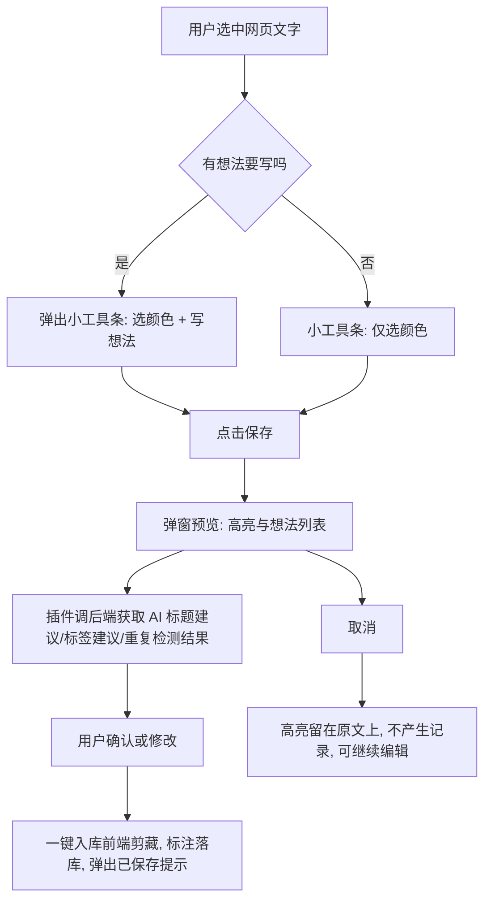
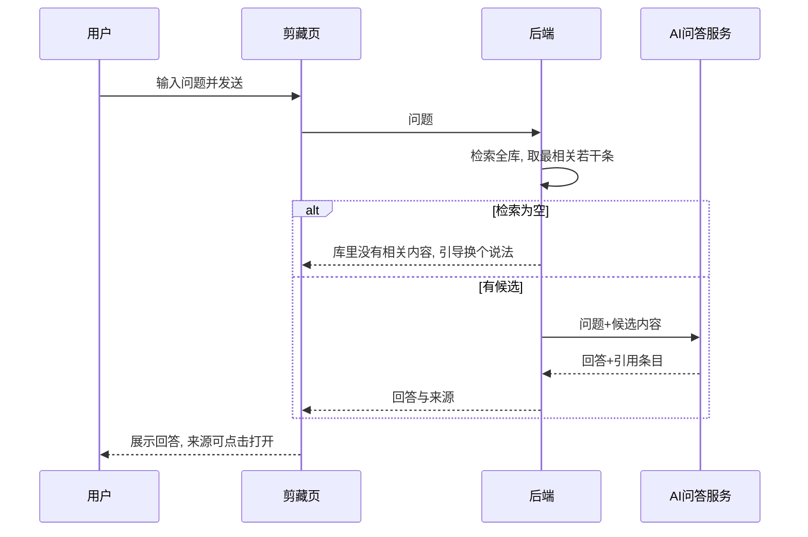

# Cubox 对标方向定版需求规格说明

创建日期：2026-09-07　状态：已定版 · 暂不开发

## 1 背景与定版结论

### 1.1 Cubox 调研结论（浓缩）

Cubox 由 Zenbox Inc 出品，定位「人生阅读记忆体」，覆盖发现、收藏、阅读、使用四个环节，不做算法推荐、社交和富文本笔记 [Research-backed]。其被验证有效的核心能力有五类：

- 收集：十余种入库方式（浏览器插件、微信、邮件、API、快捷指令、RSS），正文解析加网页快照存档，网页失效后仍可回溯；
- 管理：嵌套收藏夹、标签建议、规则驱动的智能列表、重复收藏自动检测；
- 阅读：网页标注（多色高亮加想法笔记）与标注透视列表，这是第三方评测里口碑最好的能力；
- AI：自动解读（摘要、关键问题、幻影高亮）与全库问答 Library Q&A，后者仅最高档会员可用（$69/年）；
- 开放：REST API、命令行工具 cubox-cli、Obsidian 官方插件 [Research-backed]。

它的短板同样明确：无 Windows 桌面端、仅年付订阅、无富文本编辑、AI 依赖云端按次数计费、无本地模型。

### 1.2 本产品定版决策记录

| 编号 | 决策 | 结论 |
| --- | --- | --- |
| D1 | 大背景定位 | 以 Obsidian 互补为前提：本地优先、加工整理归档全链路，不复制 Cubox 的阅读器，剪藏内容最终落库到 Obsidian vault |
| D2 | 对标侧重 | Cubox 功能对标以「浏览器插件迭代」为主战场，设计并实现第一版 MVP |
| D3 | 插件 MVP 范围 | 四件事：多色高亮、高亮上写想法、一键入库（回链原网页）、保存弹窗带 AI 标题/标签建议与重复提示 |
| D4 | 实施顺序 | 先做插件 MVP，再做保存体验，最后做全库问答（1→2→3） |
| D5 | 标注归属 | 标注分「打标」与「看标」两段：插件负责采集打标，知识模块负责标注透视（二期）；数据模型一次设计，两端共用，不是两条开发线。编辑器模块不做标注 |
| D6 | 明确不做 | 原生手机客户端、微信助手、浏览器历史同步、搜索引擎注入、本地语音转写 |

## 2 目标

- 从「在网页上看到一段话」到「入库剪藏」不超过 3 次点击，正常路径 2 次；
- 高亮和想法入库后永久可回看：软件内能看到标注，且每条标注都能跳回原网页；
- 「浏览 30 篇找结论」变成「向剪藏库提 1 个问题」，回答必须带来源条目。

衡量方式：本产品是个人工具，不做埋点 [Assumption — 不做数据指标，以自用体验感知和标注条数、问答次数人工观察为准]。

## 3 用户与核心场景

产品由作者本人自用，同时是重度 Obsidian 用户，入库内容最终会进入 vault。核心场景按优先级：

- S1 摘录留痕（最高频）：读文章时选中一段话，标色、写一句想法，一键存库，日后按原文回看；
- S2 快速入库：点插件保存，系统自动给标题、标签并提示是否存过，用户几乎不用手工整理；
- S3 问库取结论：回顾时不再逐篇翻，直接向全库提问；
- S4 看标汇总（二期）：在知识模块把散在各篇的标注汇总成透视列表。

## 4 需求总览

| 编号 | 模块 | 说明 |
| --- | --- | --- |
| FR-1.1 | 插件·多色高亮 | 选中网页文字一键高亮，4 色可选 |
| FR-1.2 | 插件·想法笔记 | 在高亮上追加一段自己的话 |
| FR-1.3 | 插件·一键入库 | 把高亮、想法、原网页链接存进剪藏，落库格式见 FR-4.1 |
| FR-1.4 | 插件·保存弹窗 | 弹窗内 AI 建议标题与标签、重复检测提示、智能选中（选中内容优先，无选中则存整页） |
| FR-2.1 | 全库问答 | 在剪藏页提问，基于全库剪藏内容回答并附来源 |
| FR-3.1 | 标注数据模型 | 标注条目挂在剪藏条目下的数据结构，插件与知识模块共用 |

## 5 模块一：浏览器插件 MVP

### 5.1 网页端交互流

### 5.2 FR-1.1 多色高亮

- 触发：任意网页选中非空文本后，出现浮层小工具条；
- 操作：点选任意一种高亮色，灰色之外的常用色加默认黄色共 4 种；
- 编辑：再次点击已高亮的片段可换色，选原件可撤销该段高亮；
- 隔离：动态页面里高亮的是按路径定位的同一串文字，不影响原网页功能和访客视角；
- 边界：视频类站点或编辑框内文字不允许高亮，可跨段连续选中；
- 异常：选中内容超过 5000 字时拒绝高亮并提示分段。

### 5.3 FR-1.2 想法笔记

- 每次加高亮或在弹窗里，都能给这条高亮补一句想法，上限 1000 字，可留空；
- 多想法支持：同一段高亮只对应一条想法（保持轻量），想法在弹窗里可见、可改。

### 5.4 FR-1.3 一键入库

- 入库范围：本次新增的高亮与想法，按条打包，存储结构见 FR-3.1；
- 剪藏内容：记录为「网页摘录」以保持老剪辑兼容，原网页链接、页面标题随条目保存；
- 回链：剪藏详情展示每条高亮，点击可跳回原网页；
- 取消语义：弹窗取消不产生任何剪藏记录；
- 异常：后端不可达时提示等待几秒可重试，插件不缓存草稿。

### 5.5 FR-1.4 保存弹窗（含保存体验三件套）

AI 建议：

- 打开弹窗时，有标题就用页面本身标题；
- 按「智能选中」按钮或弹窗确认时，把选中文字或整页正文发给后端，后端用 AI 返回建议标题、建议分类、建议标签各 1 组，用户可直接采纳或手改；
- 建议生成失败时，弹窗静默降级不阻塞，用户手动填写；
- 每次建议返回的标签与分类带上是否新增的标注，默认只作候选不自动写入。

重复检测：

- 确认保存前先查库，弹窗提示「第 N 次收藏」；
- 检测以内容指纹为准，标题标注建议改用轻量标识，用户仍可正常保存。

智能选中：

- 默认「选中内容优先」：有选中就存选中内容加所在位置，没有就存整页正文，界面显示当前将保存的范围，可一键切换。

### 5.6 插件可维护性约束

- 用户手动选择开启标注工具条，选择权与文字摘录互不干扰；
- 高亮需按页面自动恢复：用户回到之前标过的高亮时，插件可复现标注；
- 打包与回退：渲染进程增加源码映射，设定回退版本序号，正式发布前集中检验。

## 6 模块二：全库问答

### 6.1 任务定义与输入输出

- 入口：剪藏页顶部搜索旁新增「问我的剪藏库」入口，之后随编辑器 AI 面板提供同样能力；
- 输入：一段自然语言问题，上限 200 字；
- 输出：一段简明回答，回答末尾附「来源」清单，来源为库里剪藏条目（标题、时间、跳转链接），引用必须真实来自库内，生成内容不得杜撰出处；
- 检索范围：全部剪藏条目（已做索引的正文），默认不限定分类。

### 6.2 问答流程

### 6.3 质量要求与回退

- 准确性维度：回答正确性、来源引用准确性、回答完整性三项，引用不实视作失败；
- 候选限量：每次问答最多取 8 条候选片段，超出截断，保证回答速度；
- 回退策略：无相关内容时明说不答，不硬编；模型服务失败时保留问题并提示重试；判定回答低置信时改为列来源，引导用户打开原文确认；
- 溯源约束：每条回答必须能追溯到候选，边界提问宁可说不知道，也要保引用保真。

## 7 模块三：标注数据模型（打标与看标共用）

- 定位：一次设计、两端共用，插件为唯一写入方（采集端），知识模块为只读汇总方（二期）；
- 归属：一条剪藏下挂零到多条标注，标注随剪藏内容原样落库，符合现有存储习惯；
- 每条标注字段：唯一标识、原文片段、想法（可为空）、颜色（枚举 4 色）、来源网页链接、来源页面标题、创建时间、更新时间；来源固定为插件；
- 兼容规则：历史条目没有该字段视为空列表，不迁移、不补写；
- 前端落库规则：剪藏详情额外给标注区把每条标注的原文、想法、颜色按录入顺序展示，支持跳回原网页；
- 二期看标要求：知识模块增加标注透视列表，按颜色、来源、创建时间筛选，可从列表直达所属条目并回原网页。

## 8 实施顺序、边界与验收

### 8.1 实施顺序

先做插件 MVP（FR-1.1～FR-1.4），再做全库问答（FR-2.1），标注数据模型（FR-3.1）随第一篇落库同步定稿。插件 MVP 的保存弹窗即覆盖保存体验三件套，它作为 MVP 的收尾单独检查。

### 8.2 二期事项（本次不开发）

知识模块标注透视（D5 看标段）；网页快照存档；剪藏智能列表；AI 解读三件套与自动解读开关；对外入库 API 及命令行工具；Cubox 数据互操作。

### 8.3 验收标准汇总

| 编号 | 验收 |
| --- | --- |
| AC-1 | 网页选中文字出现工具条，4 色高亮、换色、撤销均可操作 |
| AC-2 | 高亮与想法保存入剪藏，详情页可见并跳回原网页 |
| AC-3 | 保存前弹窗显示 AI 拟标题、分类、标签，采纳或手改均能保存 |
| AC-4 | 重复保存时弹窗明确提示次数，仍可继续保存 |
| AC-5 | 取消弹窗不产生任何记录 |
| AC-6 | 全库问答返回有来源的回答，来源可点击打开；无相关内容时明说不知道 |
| AC-7 | 历史剪藏条目打开正常，新增标注字段不损坏老库 |

### 8.4 风险与假设

- 依赖：全库问答依赖现有检索与 AI 问答服务能力，实施前需验证多条目检索的可用性 [待确认]；
- 兼容：标注字段扩大后老版本打开新库不报错、只多显示标注区 [规则已定，代码需兼容解析]；
- 假设：插件端 AI 建议失败属可接受降级，不阻塞保存 [Assumption — 已确认]；
- 假设：本迭代不做任何数据埋点 [Assumption — 已确认]。